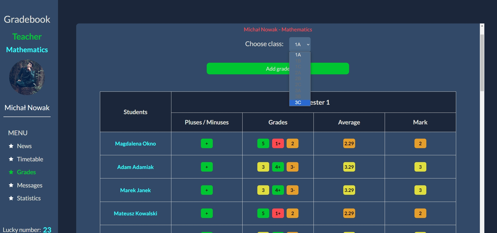
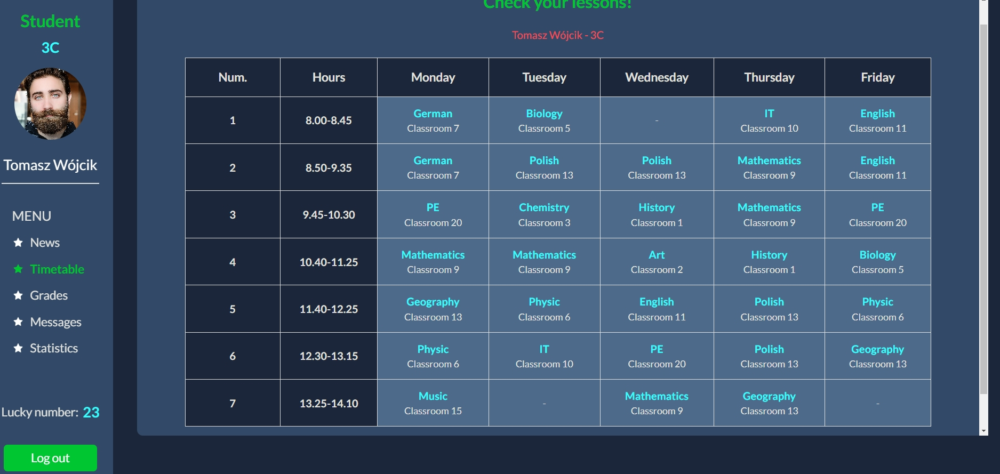
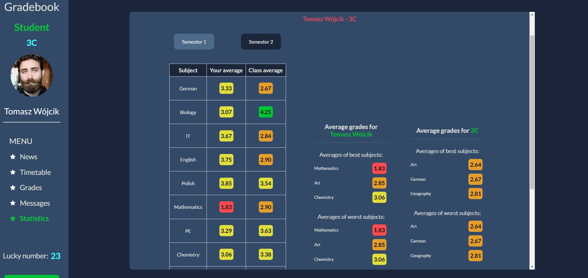

<h1>Gradebook</h1>

Hello, I present to you my **Gradebook** project. I was thinking about creating a project that will bring together front-end, working with api and a little bit of database knowledge / a bit of back-end code mixed with each other. From that came to my mind a Gradebook project. The project is created in NextJS using a small amount of React Redux, Firebase, MongoDB and written in Typescript.
The page is not fully responsive - it is meant to be used on computer screens, not on mobile devices. The project shows different information based on whether you are logged in as a teacher or as a student.

I encourage you to check the website - uploaded to vercel <a href='https://gradebook-mu.vercel.app'>Gradebook</a>

<b>To log in as a student you need to use the login dataset:</b>

-   login: student1@student.com ; password: student1

<b>To log in as a teacher:</b>

-   login: teacher1@teacher.com ; password: teacher1

<i>Student and teacher ID are not imposed in advance, just don't leave it empty.</i>

<h2>📫 Page contains</h2>

-   login page and full login firebase support (log in, log out, check if the user is logged in),
-   news page with some basic non-deletable dummy news - as a student you can only read this news, as a teacher you can add another,
-   timetable plans for students and for teachers,
-   grade section, where a student can check his grades from 2 semesters - as a teacher you can add grades to students in the subject you teach (in this demo page only 2 classes are available: 1A and 3C to work with in 2 subjects - Maths and Geography),
-   statistics page, as a student you can see your averages in every subject and averages of your whole class, as a teacher you see averages from every class and of the whole school to compare with,
-   accessibility practices,
-   using firebase to log in / log out and auth management,
-   using MongoDB to store some database information,
-   using LocalStorage to store some auth data,
-   using dummy data in database.

<h2>🛠 Used tools / programming languages / technologies</h2>

-   HTML / CSS,
-   NextJS (React Redux),
-   Typescript,
-   Firebase,
-   MongoDB,
-   Local Storage,
-   Git / Github.
